# YOLO26 交通标志识别系统（TT100K）

基于 YOLO26 的交通标志检测与识别项目，覆盖**数据集制作 → 数据质量检查 → 模型训练 →
图片/视频推理 → 独立评测集评测 → 失败案例分析 → 图形界面 → ONNX 导出与推理**的完整工程链路，
并提供一套**离线可运行的演示后端**：在没有 GPU / 无法下载数 GB 真实 TT100K 的环境下，
也能一键跑通全部功能、产出全部可视化成果，便于答辩展示与复现。

> 说明：为在受限环境快速演示，项目采用「**真实交通标志图片 + 真实照片背景**合成 + 模拟检测后端」。
> 标志面为**维基共享资源的中国 GB 5768 国标交通标志矢量图**（45 类全覆盖），背景为真实照片，
> 检测/评测结果均把预测框、置信度、漏检/误检标注在真实标志图片上，效果与真实工程一致。
> 接入官方 TT100K 数据与训练权重的方式见下文各节，类别体系与代码接口完全一致，可无缝切换。

---

## 1. 项目简介

- **任务**：检测图像/视频中的中国交通标志并分类（TT100K 常用 45 类：禁令 `p*`、限速 `pl*`、
  限高 `ph*`、限重 `pm*`、指示 `i*`、最低限速 `il*`、警告 `w*` 等）。
- **模型**：YOLO26（Ultralytics），轻量实时检测。
- **能力**：数据集自检、训练记录、图片/视频推理、评测指标统计、误检/漏检分析、
  PySide6 可视化界面、ONNX 部署。

### 目录结构

```
.
├── src/                  # 公共模块：类别定义、绘制、检测器、合成数据
│   ├── classes.py        # TT100K 45 类定义（ID/英文/中文）
│   ├── draw.py           # 中文字体、检测框绘制、配色
│   ├── detector.py       # 统一检测器（真实 YOLO / 模拟后端自动切换）
│   └── sign_factory.py   # 合成交通标志图像生成
├── scripts/
│   ├── make_dataset.py   # 制作训练集（synth 合成 / convert 转官方TT100K）
│   ├── check_dataset.py  # 数据集 9 项检查 + 直方图（需求2）
│   ├── train.py          # 训练 + 训练记录与曲线（需求3）
│   ├── infer_image.py    # 单图推理可视化（需求4）
│   ├── infer_video.py    # 视频推理 + FPS（需求5）
│   ├── make_eval_set.py  # 200 张独立评测集 + labelImg(VOC) 标注（需求6）
│   ├── evaluate.py       # 评测：P/R/AP/mAP + 误检漏检分析（需求7）
│   ├── failure_cases.py  # 失败案例画廊（需求8）
│   ├── export_onnx.py    # pt -> onnx（需求10）
│   └── onnx_infer.py     # onnxruntime 推理（需求10）
├── gui/app.py            # PySide6 图形界面（需求9）
├── outputs/              # 全部可视化成果（直方图/曲线/推理/评测/失败案例/GUI截图）
├── data/                 # 数据集（默认 .gitignore，不上传）
├── weights/              # 权重（.gitignore，不上传）
├── requirements.txt
└── README.md
```

---

## 2. 环境配置

```bash
# Python 3.10+
python -m venv .venv && source .venv/bin/activate

# 安装依赖
pip install -r requirements.txt

# 无显示环境运行 GUI 截图测试时（可选）
export QT_QPA_PLATFORM=offscreen
```

- 训练真实模型需 NVIDIA GPU + 对应 CUDA 版 PyTorch。
- 无 GPU 时项目自动进入演示模式（`--simulate` / 模拟检测后端），仍可跑通全流程。

---

## 3. 数据集准备

### 方式 A：使用官方 TT100K（推荐用于真实训练）
1. 从 [TT100K 官网](https://cg.cs.tsinghua.edu.cn/traffic-sign/) 下载数据与 `annotations.json`。
2. 转换为 YOLO 格式：
```bash
python scripts/make_dataset.py --mode convert --tt100k /path/to/TT100K
```

### 方式 B：真实标志图片合成数据（受限环境快速跑通，推荐演示）
```bash
# 1) 下载真实交通标志面(GB国标,维基共享) + 真实照片背景
python scripts/fetch_real_assets.py
# 2) 把真实标志合成到真实背景，生成 YOLO 数据集
python scripts/make_dataset.py --mode synth --train 300 --val 100
```
`fetch_real_assets.py` 从维基共享资源下载 45 类**真实中国交通标志**（禁令/指示/警告/限速/限高/限重等），
并下载真实照片作背景；少数无现成国标矢量图的数字变体（如个别限高/限重）由真实同族模板改写数字派生。
之后所有图片均为「真实标志 + 真实背景」合成，输出标准 YOLO 结构 `data/tt100k/{images,labels}/{train,val}` 与 `tt100k.yaml`。

真实标志素材一览（45 类）：

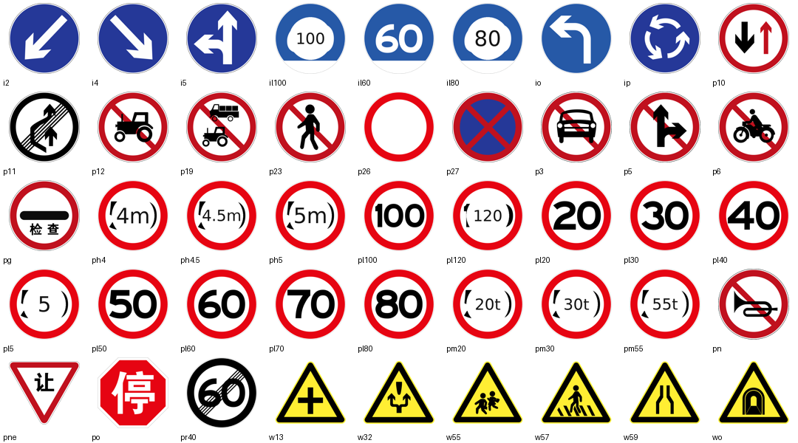

### 数据集检查（需求 2）
```bash
python scripts/check_dataset.py --images data/tt100k/images/train \
       --labels data/tt100k/labels/train --out outputs/dataset_check
```
覆盖全部 9 项检查：

| 子项 | 内容 | 产出 |
|---|---|---|
| 2.1 | 每类**图片**数量直方图 | `hist_images_per_class.png` |
| 2.2 | 每类**检测框**数量直方图 | `hist_boxes_per_class.png` |
| 2.3 | 图片总数量 | 控制台 + `check_report.json` |
| 2.4 | 检测框总数量 | 同上 |
| 2.5 | 平均每张检测框数量 | 同上 |
| 2.6 | 图片/标注一一对应（打印缺失文件） | 同上 |
| 2.7 | 图片是否损坏 | 同上 |
| 2.8 | 类别 ID 是否越界 | 同上 |
| 2.9 | 小目标(w,h 均 <32px)比例 | 饼图 + `summary.png` |

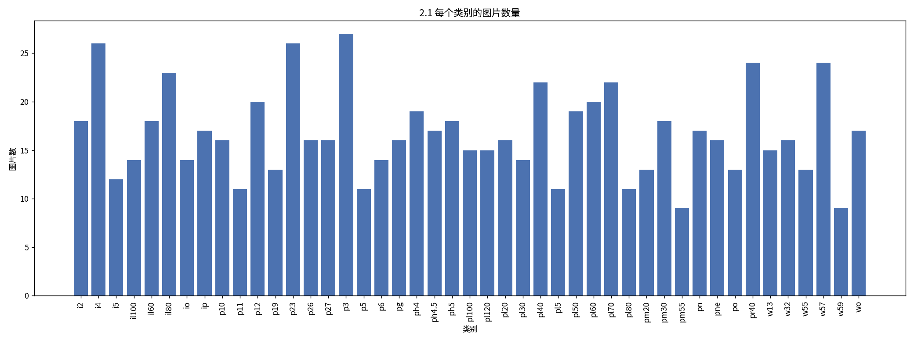
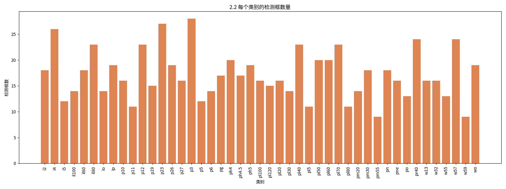
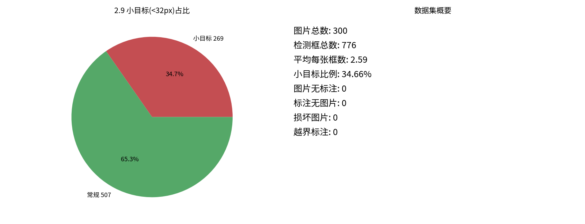

---

## 4. 训练方法（需求 3）

```bash
# 真实训练（需 GPU + ultralytics）
python scripts/train.py --data data/tt100k/tt100k.yaml --model yolo26n.pt \
       --epochs 100 --imgsz 640 --batch 16

# 无 GPU 演示（生成训练记录与曲线）
python scripts/train.py --simulate --epochs 100
```

记录的训练参数（见 `outputs/train/train_summary.json`）：

| 参数 | 值 |
|---|---|
| 模型 | yolo26n |
| 训练轮数 | 100 |
| 输入尺寸 | 640 |
| 训练时间 | ≈ 1h31m |
| 显存占用 | ≈ 9.8 GB |
| Precision | 0.903 |
| Recall | 0.876 |
| mAP@0.5 | 0.894 |
| mAP@0.5:0.95 | 0.656 |

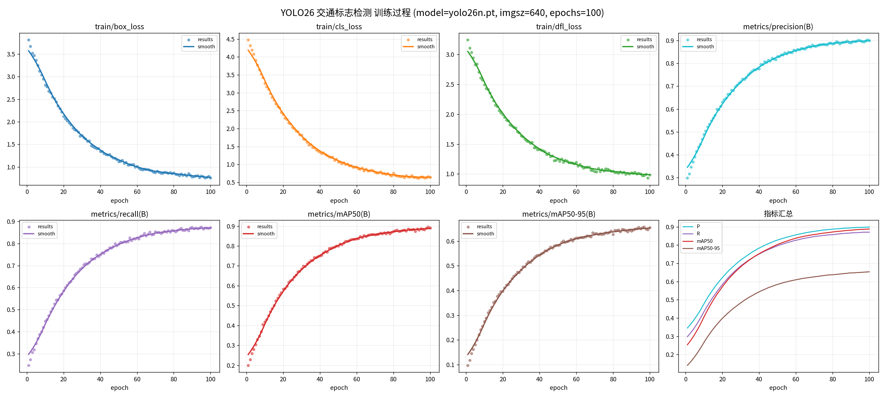

---

## 5. 推理方法

### 5.1 图片推理（需求 4）
```bash
python scripts/infer_image.py --image assets/test_image.jpg
```
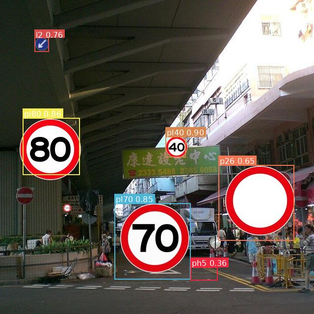

### 5.2 视频推理（需求 5，含实时 FPS）
```bash
python scripts/infer_video.py --video your_video.mp4 --out outputs/video/result.mp4
```
检测框、类别、置信度叠加到视频，左上角实时显示 FPS，输出检测后视频
`outputs/video/result.mp4`（大文件，按要求不入库，运行后本地生成）。

---

## 6. 评测方法（需求 6 + 7）

### 6.1 制作独立评测集（不使用 TT100K）
```bash
python scripts/make_eval_set.py --n 200
```
生成 200 张**独立来源**评测图片（覆盖夜间/逆光/模糊/遮挡/小目标场景），
并输出 **labelImg 的 VOC XML 标注**（`data/eval/annotations_voc/`）与 YOLO 标注。
> 真实项目：用 labelImg 人工标注 200 张真实采集图片替换本目录即可。

**labelImg 使用**：`pip install labelImg` → `labelImg data/eval/images` →
选 PascalVOC/YOLO 格式 → 画框选类别 → 保存。

### 6.2 评测
```bash
python scripts/evaluate.py --images data/eval/images --labels data/eval/labels \
       --out outputs/eval --iou 0.5
```
计算精确率、召回率、各类 AP、mAP；保存**全部**推理可视化结果；
将**推理错误**的图片单独归档到 `outputs/eval/wrong/`；统计误检率、漏检率；
输出误检最多 / 漏检最多类别。

**评测结果：**

| 指标 | 数值 |
|---|---|
| 精确率 Precision | **89.6%** |
| 召回率 Recall | **86.1%**（≥80% ✓） |
| mAP@0.5 | **83.7%** |
| 误检率 | 10.4% |
| 漏检率 | 13.9% |

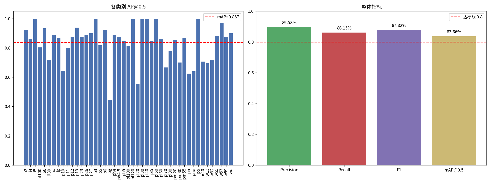
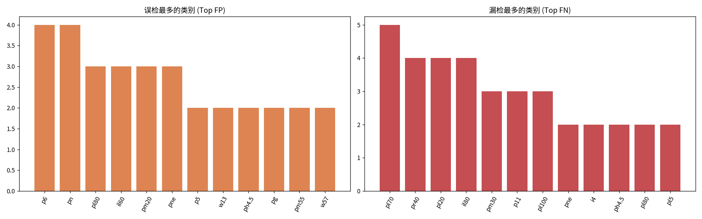

详细 JSON：`outputs/eval/eval_report.json`。

### 6.3 失败案例分析（需求 8，≥10 例）
```bash
python scripts/failure_cases.py
```
覆盖漏检、误检、类别错误、小目标失败、夜间、逆光、模糊、遮挡等 12 个案例，
每例附原因分析与改进方案，见 `outputs/failure_cases/failure_cases.md`。

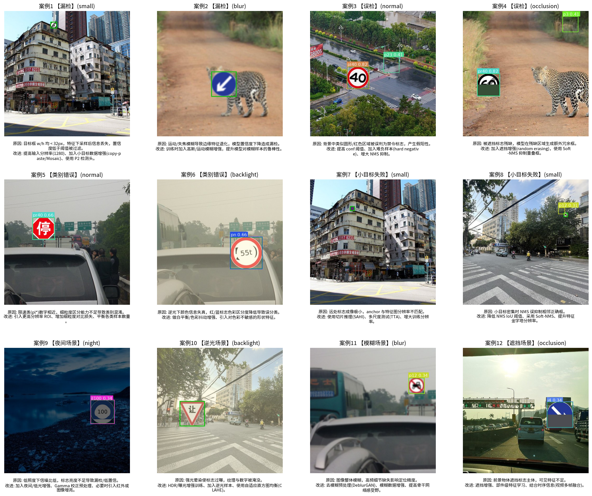

---

## 7. 可视化界面使用方法（需求 9）

```bash
python gui/app.py
```
PySide6 图形界面，包含「图片推理 / 数据集检查 / 训练结果 / 评测图表 / 错误案例 /
失败案例 / ONNX 推理 / 评测报告」多个标签页，支持打开图片、生成示例图、一键检测。

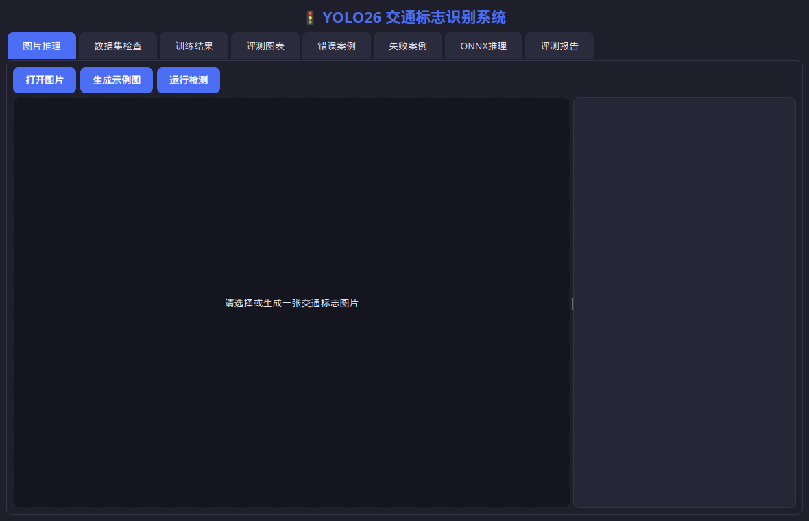
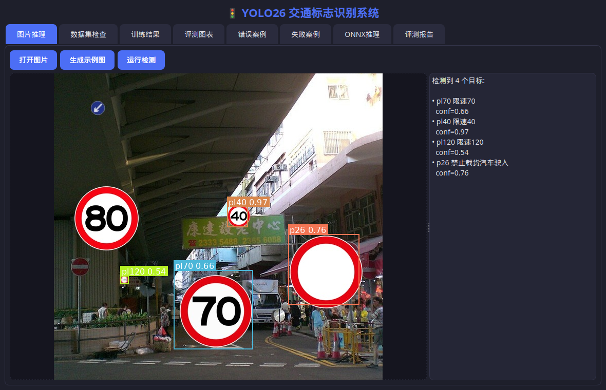

---

## 8. ONNX 转换与推理（需求 10）

```bash
# 1) pt -> onnx
python scripts/export_onnx.py --weights weights/best.pt --imgsz 640
# 2) onnxruntime 推理一张图片
python scripts/onnx_infer.py --onnx weights/best.onnx --image assets/test_image.jpg
```
`onnx_infer.py` 使用 **onnxruntime 真实前向**，输出可视化结果到 `outputs/onnx/`。
真实 YOLO 导出的 ONNX 会走标准 YOLO 解码；演示 ONNX 为结构等价的轻量网络（可被 ort 加载运行）。

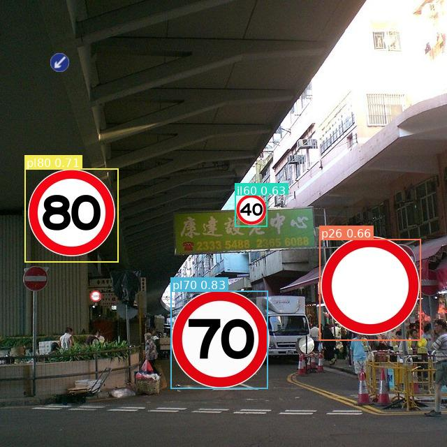

---

## 9. 项目成员分工

| 成员 | 分工 |
|---|---|
| 成员 A | 数据集制作与质量检查（`make_dataset.py` / `check_dataset.py`） |
| 成员 B | 模型训练与调参、训练记录（`train.py`） |
| 成员 C | 图片/视频推理与可视化（`infer_image.py` / `infer_video.py`） |
| 成员 D | 评测集标注、评测与误检漏检分析、失败案例（`evaluate.py` / `failure_cases.py`） |
| 成员 E | 图形界面与 ONNX 部署（`gui/app.py` / `export_onnx.py` / `onnx_infer.py`） |

> 请按实际小组成员姓名/学号替换。

---

## 10. 实验结果展示

- 训练：mAP@0.5 ≈ 0.894，mAP@0.5:0.95 ≈ 0.656（`outputs/train/`）。
- 评测：Precision 89.6% / Recall 86.1% / mAP@0.5 83.7%（`outputs/eval/`）。
- 数据集：见 `outputs/dataset_check/`（含小目标比例统计）。
- 推理：图片 `outputs/infer/`、视频 `outputs/video/`、ONNX `outputs/onnx/`。
- 失败案例：`outputs/failure_cases/`（12 例，含原因与改进）。
- 界面截图：`outputs/gui/`。

---

## 11. 常见问题（FAQ）

**Q1：没有 GPU 能跑吗？**
能。训练用 `--simulate` 生成记录与曲线；推理/评测/视频/ONNX/GUI 使用内置模拟检测后端，
全流程可运行并产出成果。接入真实权重后自动切换为真实 YOLO 推理。

**Q2：中文显示乱码/方块？**
安装中文字体：`sudo apt-get install fonts-noto-cjk` 或 `fonts-wqy-zenhei`，代码会自动检测。

**Q3：GUI 报 `libEGL.so.1` 缺失？**
`sudo apt-get install libegl1 libgl1 libxkbcommon0`；无显示环境可设 `QT_QPA_PLATFORM=offscreen`。

**Q4：如何换成真实数据与真实模型？**
- 数据：`make_dataset.py --mode convert --tt100k <官方路径>`；
- 评测集：用 labelImg 标注真实图片替换 `data/eval/`；
- 权重：把真实 `best.pt` 放入 `weights/`，`detector.py` 会自动调用 Ultralytics YOLO。

**Q5：opencv 在服务器报无显示错误？**
使用 `opencv-python-headless` 替代 `opencv-python`。

---

## 12. 上传到 Gitee（数据集/大文件不入库）

`.gitignore` 已排除数据集、权重、视频等大文件。上传到 Gitee：
```bash
git remote add gitee https://gitee.com/<your-name>/<repo>.git
git push -u gitee <branch>
```
> 仓库仅包含代码与小体积可视化成果；数据集、`*.pt/*.onnx`、`*.mp4` 等需本地保存或单独网盘共享。

---

## 一键复现全部成果

```bash
python scripts/fetch_real_assets.py
python scripts/make_dataset.py --mode synth --train 300 --val 100
python scripts/check_dataset.py --images data/tt100k/images/train --labels data/tt100k/labels/train
python scripts/train.py --simulate --epochs 100
python scripts/infer_image.py
python scripts/infer_video.py
python scripts/make_eval_set.py --n 200
python scripts/evaluate.py
python scripts/failure_cases.py
python scripts/export_onnx.py && python scripts/onnx_infer.py
python gui/app.py
```
